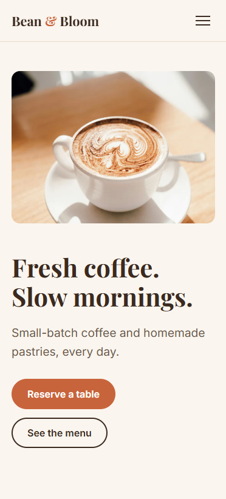
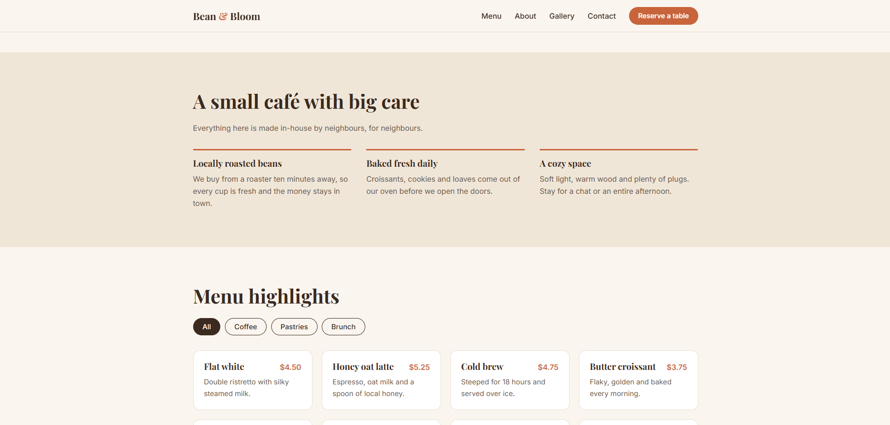

# Bean & Bloom Café: Landing Page

A responsive, single-page website for a fictional local café. The goal is to get nearby customers to view the menu and reserve a table.

**Live site:** https://bilalmughal22.github.io/BeanBloomCafe/

<p>
  
  
</p>

## Features

- Sticky navigation with a hamburger menu on mobile
- Hero section with two clear calls to action
- Menu highlights with category filters (All, Coffee, Pastries, Brunch)
- Responsive gallery grid
- Customer testimonials
- Opening hours, address and a static map
- Reservation form with validation, inline error messages and a success message
- Scroll-reveal animations and smooth scrolling (both switch off for visitors who prefer reduced motion)

## Built with

- HTML5 (semantic elements, alt text, meta viewport)
- CSS3 (Grid, Flexbox, custom properties)
- Vanilla JavaScript (no frameworks or libraries)
- Google Fonts: Playfair Display and Inter

## Design

| Role | Value |
|---|---|
| Background | `#FAF5EE` (cream) |
| Text | `#3B2A20` (espresso brown) |
| Accent | `#C8643B` (terracotta) |

## Performance

Lighthouse scores (mobile):

| Performance | Accessibility | Best Practices | SEO |
|---|---|---|---|
| 96 | 96 | 100 | 100 |

Images are converted to WebP and kept small to keep load times low.

## Responsive testing

Checked at 375px (phone), 768px (tablet) and 1280px (desktop) in Chrome DevTools.

## Run it locally

Lighthouse and some browser features need the page served over HTTP, so avoid opening the file directly.

1. Clone the repo:
   ```bash
   git clone https://github.com/YOUR-USERNAME/YOUR-REPO.git
   cd YOUR-REPO
   ```
2. Start a local server, using one of:
   - VS Code: right-click `index.html` and choose **Open with Live Server**
   - Python: `python -m http.server 8000`, then visit `http://localhost:8000`

## Project structure

```
.
├── index.html
├── images/
│   ├── hero.webp
│   ├── gallery-1.webp ... gallery-6.webp
│   └── map.webp
├── screenshots/
└── README.md
```

## Credits

- Photos: [Unsplash](https://unsplash.com) / [Pexels](https://pexels.com). Add photographer names here, for example "Hero photo by Name on Unsplash".
- Map: © OpenStreetMap contributors (if you use an OpenStreetMap screenshot)
- Café name, address, menu and testimonials are fictional placeholders.

## License

This is a personal portfolio project. Feel free to use it as inspiration.
